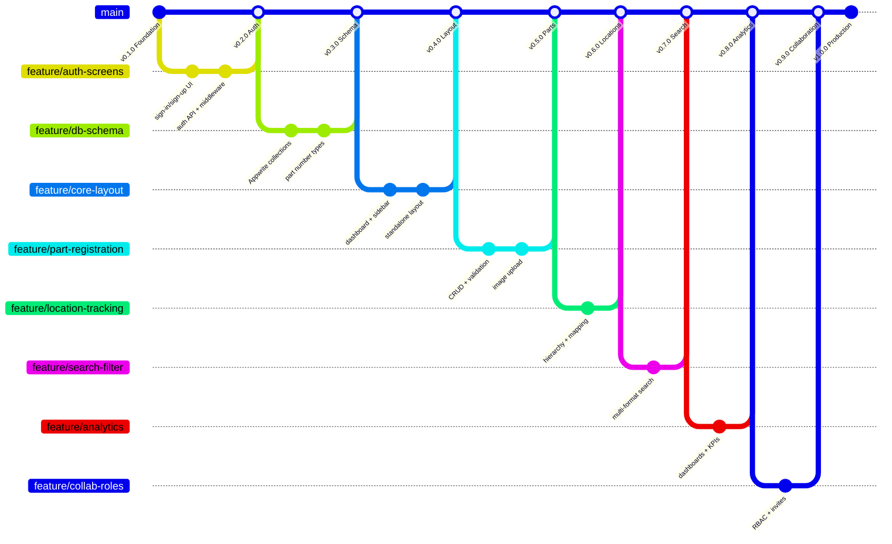

# Installed Base Lifecycle Management

A centralized digital system for managing Siemens railway infrastructure components throughout their operational lifecycle. Replaces manual Excel-based tracking with real-time visibility, searchable part records, compatibility verification, and analytics dashboards.

**Author:** Peter Dike  
**Stakeholder:** Christoph Becker (Siemens Engineering Procurement)  
**License:** MIT

## Problem

Railway infrastructure installed base is currently managed in Excel spreadsheets. This creates limited scalability, no real-time visibility, difficult compatibility tracking across fleets, and error-prone manual data entry. Components have 15+ year lifecycles with interval-based revisions -- tracking this manually does not scale.

## What This System Does

- **Part Registration** -- Record serial numbers, product revisions, software releases, and installation dates across all Siemens numbering formats (WLN, A2V, AN, Stammhaus)
- **Location Tracking** -- Geographic and hierarchical tracking (fleet > train > car > system > equipment level)
- **Lifecycle Management** -- Track installation events, system expansions, reserves, and warehouse inventory
- **Search & Query** -- Multi-format part number search, location-based filtering, compatibility verification
- **Analytics** -- Dashboard KPIs, trend analysis, proactive maintenance planning
- **Access Control** -- Role-based permissions for product managers, procurement, and operations teams

## Getting Started

### Prerequisites

- [Bun](https://bun.sh) (v1.3+)
- [Node.js](https://nodejs.org) (v20 LTS, installed via nvm)

### Installation

```bash
git clone https://github.com/CPD9/base-lifecycle.git
cd base-lifecycle
bun install
```

### Development

```bash
bun run dev
```

Open [http://localhost:3000](http://localhost:3000).

### Build

```bash
bun run build
bun run start
```

## Project Structure

```
src/
  app/                    # Next.js App Router pages and layouts
    (auth)/               # Authentication pages (sign-in, sign-up)
    (dashboard)/          # Main application with sidebar navigation
    (standalone)/         # Settings and onboarding pages
    api/[[...route]]/     # Hono.js catch-all API handler
  features/               # Domain modules (feature-based architecture)
    auth/                 # Authentication logic, components, schemas
    parts/                # Part registration and management (planned)
    locations/            # Location hierarchy and tracking (planned)
    members/              # Team and role management (planned)
    projects/             # Fleet/system groupings (planned)
    search/               # Search and filter engine (planned)
    analytics/            # Dashboards and KPIs (planned)
  components/
    ui/                   # Shadcn UI component library
    dotted-separator.tsx  # Custom shared components
    query-provider.tsx    # React Query client provider
  lib/                    # Utilities (cn helper, Appwrite client, etc.)
  config/                 # Environment constants and collection IDs
  hooks/                  # Shared React hooks
  types/                  # Shared TypeScript type definitions
```

## Siemens Part Number Formats

The system supports four Siemens numbering conventions:

| Format | Pattern | Example |
|--------|---------|---------|
| WLN (Wallisellen) | 4 letters + 4 numbers + 1 char + 3 numbers | `ABCD1234-567` |
| A2V (HQ SAP) | 14-digit, starts with A2V or A6Z | `A2V00002384593` |
| AN (Switzerland SAP) | 14-digit, starts with A5N | `A5N00033075035` |
| Stammhaus | 3-block hyphenated | `6XX6220-0AB10` |

## Version History

| Version | Tag | Description |
|---------|-----|-------------|
| v0.1.0 | `v0.1.0` | Project scaffold, Shadcn UI component library |
| v0.2.0 | `v0.2.0` | Auth screens, Siemens branding, form validation |
| v0.3.0 | *in progress* | Hono API setup, auth API, query provider |

## Branching Strategy

Trunk-based development following [Google engineering practices](https://google.github.io/eng-practices/):



| Branch pattern | Use | Example |
|----------------|-----|---------|
| `main` | Always deployable | -- |
| `feature/<name>` | New functionality | `feature/part-registration` |
| `bugfix/<name>` | Non-critical fix | `bugfix/wln-validation-regex` |
| `hotfix/<name>` | Critical production fix | `hotfix/auth-session-expired` |

See [docs/TECHNICAL_DECISIONS.md](docs/TECHNICAL_DECISIONS.md) for full technology rationale and branching rules.

## Team

| Name | Role | Contact |
|------|------|---------|
| Peter Dike | Backend, database, API, deployment | -- |
| Adrian Kenel | Data modeling, business logic, requirements | adrian.kenel@stud.hslu.ch |
| Jules | Stakeholder requirements, testing, documentation | jlswld@pm.me |
