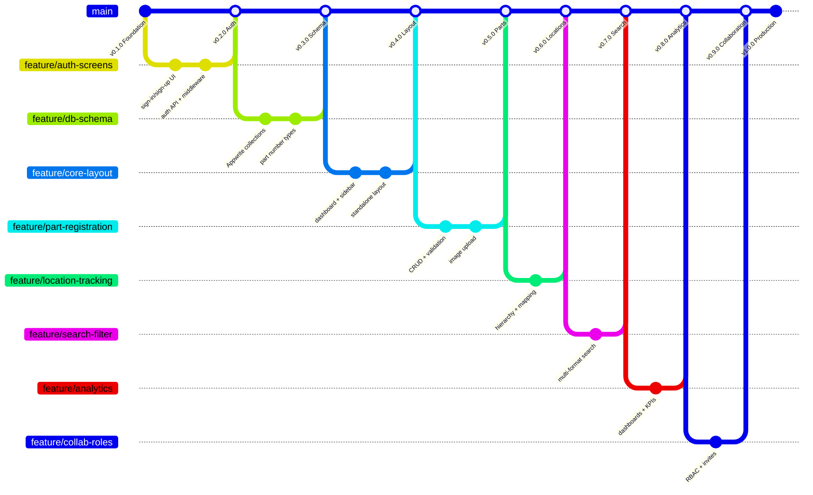

# Technical Decisions

**Author:** Peter Dike  
**Last updated:** February 2026

This document records every significant technology choice made in the Installed Base Lifecycle Management project, the alternatives we considered, and why we chose what we did. It is maintained incrementally as new dependencies are added.

---

## Table of Contents

1. [Runtime and Package Manager](#1-runtime-and-package-manager)
2. [Framework](#2-framework)
3. [API Layer](#3-api-layer)
4. [Backend-as-a-Service](#4-backend-as-a-service)
5. [UI Component Library](#5-ui-component-library)
6. [Styling](#6-styling)
7. [Form Handling and Validation](#7-form-handling-and-validation)
8. [State Management](#8-state-management)
9. [Data Visualization](#9-data-visualization)
10. [Language and Type Safety](#10-language-and-type-safety)
11. [Version Control Strategy](#11-version-control-strategy)
12. [Full Dependency Reference](#12-full-dependency-reference)

---

## 1. Runtime and Package Manager

### Decision: Bun (v1.3.9)

**Why not npm/yarn/pnpm?**

Bun is an all-in-one JavaScript runtime and toolkit built on JavaScriptCore (the same engine behind Safari). We chose it over npm for three practical reasons:

- **Speed** -- `bun install` is 10-25x faster than `npm install`. On this project, a full install takes ~2 seconds vs ~20+ seconds with npm. Over hundreds of installs during development, this compounds significantly.
- **Built-in bundler and test runner** -- Bun ships with native TypeScript execution, a bundler, and a test runner. This reduces the number of dev dependencies we need to manage.
- **Drop-in compatibility** -- Bun runs the same `package.json` scripts, reads the same `node_modules`, and is compatible with the npm registry. If we ever need to switch back to npm, nothing breaks.

**Trade-off:** Bun is newer and has a smaller ecosystem of edge-case bug reports compared to Node.js. For a greenfield project like ours this is acceptable -- we are not inheriting legacy Node-specific code.

**Alternatives considered:**
- `npm` -- Default Node.js package manager. Reliable but significantly slower.
- `pnpm` -- Fast, disk-efficient via hard links. Good option but Bun is faster and gives us the runtime too.
- `yarn` -- No meaningful advantage over pnpm or Bun for our use case.

---

## 2. Framework

### Decision: Next.js 14 (App Router)

**Why Next.js?**

Next.js is the production framework for React. It provides server-side rendering, static generation, API routes, file-based routing, and built-in optimizations (image handling, font loading, code splitting) out of the box.

**Why version 14 specifically?**

- v14 is the latest stable release in the App Router lineage before the v15 breaking changes.
- The tutorial reference material targets v14, keeping our learning and codebase aligned.
- v14 has mature community support and well-documented patterns.

**Why App Router over Pages Router?**

- App Router uses React Server Components by default, reducing client-side JavaScript.
- Route groups `(auth)`, `(dashboard)`, `(standalone)` let us apply different layouts without affecting URL structure -- essential for our auth vs. dashboard vs. settings layouts.
- Server Actions and streaming are built in for future use.

**Alternatives considered:**
- `Remix` -- Excellent data loading model, but smaller ecosystem and less corporate adoption.
- `Vite + React` -- No SSR out of the box. We need server-side route protection for role-based access.
- `SvelteKit` -- Strong framework, but React's ecosystem (component libraries, hiring pool, Siemens internal tooling familiarity) makes React the pragmatic choice.

---

## 3. API Layer

### Decision: Hono.js

**Why Hono over Next.js API routes?**

Hono is a lightweight, high-performance web framework designed for edge runtimes. We use it inside a Next.js catch-all route (`/api/[[...route]]`) to handle all backend API logic.

- **Type-safe RPC** -- Hono's client (`hc`) provides end-to-end type safety between API routes and frontend calls. When we change an API response shape, TypeScript catches mismatches at compile time.
- **Middleware composition** -- Hono's middleware model (session validation, role checking, request logging) is cleaner than stacking Next.js middleware + API route logic.
- **Framework-agnostic** -- If we ever need to extract the API into a standalone service, Hono runs on Cloudflare Workers, Deno, Bun, and Node.js without code changes.
- **Zod integration** -- `@hono/zod-validator` validates request bodies at the API boundary with the same Zod schemas we use on the frontend forms. One schema, two enforcement points.

**Alternatives considered:**
- Native Next.js API routes -- Simpler, but no built-in RPC type safety and middleware composition is limited.
- `tRPC` -- Excellent type safety, but tightly coupled to the framework and harder to extract later.
- `Express` -- Battle-tested but heavy, slower, and designed for a different era.

---

## 4. Backend-as-a-Service

### Decision: Appwrite (planned)

**Why Appwrite?**

Appwrite is an open-source Backend-as-a-Service providing authentication, databases, storage, and serverless functions. We chose it because:

- **Self-hostable** -- Critical for a Siemens project where data sovereignty matters. We can deploy Appwrite on Siemens infrastructure rather than sending railway data to a third-party cloud.
- **Built-in auth** -- OAuth (Google, GitHub, Microsoft, Apple) and email/password authentication with session management, so we do not build auth from scratch.
- **Document database** -- Flexible schema that fits our domain well: parts, locations, installations, and members are naturally document-shaped with varying attributes.
- **File storage** -- Built-in image/document storage with access controls for component photos and attachments.
- **SDKs** -- `node-appwrite` (server-side, admin operations) and `appwrite` (client-side, session-scoped) provide typed APIs.

**Alternatives considered:**
- `Supabase` -- PostgreSQL-based, excellent for relational data. Strong contender, but Appwrite's self-hosting story is simpler and we do not need SQL joins for our primary access patterns.
- `Firebase` -- Vendor-locked to Google Cloud. Not suitable for Siemens data residency requirements.
- `Custom PostgreSQL + Prisma` -- Maximum flexibility, but significantly more development time for auth, storage, and access control that Appwrite gives us for free.

---

## 5. UI Component Library

### Decision: Shadcn UI (New York style, v2.1.0)

**Why Shadcn?**

Shadcn is not a traditional component library -- it is a collection of copy-paste components built on Radix UI primitives. Components are installed directly into our codebase (`src/components/ui/`), not imported from `node_modules`.

- **Full ownership** -- Every component lives in our repo. We can customize anything without fighting library abstractions. We already customized `button.tsx` with Siemens brand colors and gradient variants.
- **Accessible by default** -- Built on Radix UI, which handles keyboard navigation, screen readers, and focus management correctly. For a tool used by non-technical procurement staff, accessibility is not optional.
- **Consistent design** -- The New York style provides a clean, professional aesthetic appropriate for an enterprise tool.
- **Tree-shakeable** -- Only the components we install are in the bundle. No unused component bloat.

**Components installed (27):**
`avatar`, `badge`, `button`, `calendar`, `card`, `carousel`, `chart`, `checkbox`, `dialog`, `drawer`, `dropdown-menu`, `form`, `input`, `input-group`, `label`, `popover`, `scroll-area`, `select`, `separator`, `sheet`, `sidebar`, `skeleton`, `sonner`, `table`, `tabs`, `textarea`, `tooltip`

**Alternatives considered:**
- `Material UI` -- Heavy bundle, Google-specific design language. Opinionated theming makes Siemens branding harder.
- `Ant Design` -- Enterprise-focused but very opinionated and large. Harder to customize deeply.
- `Chakra UI` -- Good DX but runtime CSS-in-JS has performance costs in SSR.

---

## 6. Styling

### Decision: Tailwind CSS v3.4

**Why Tailwind?**

Utility-first CSS that co-locates styles with markup. No separate CSS files to maintain, no class naming debates, and the compiler purges unused classes for minimal production CSS.

- **Design token integration** -- We defined the full Siemens color palette (`siemens-50` through `siemens-900`, anchored on `#009999`) directly in `tailwind.config.ts`. Every component references these tokens, so a brand update is a single config change.
- **Responsive design** -- Mobile-first responsive prefixes (`md:`, `lg:`) are essential for field use on tablets.
- **Shadcn compatibility** -- Shadcn is built for Tailwind. CSS variables in `globals.css` drive the theme.

**Supporting packages:**
- `tailwindcss-animate` -- Animation utilities used by Shadcn components (dialog open/close, sheet slide, etc.)
- `tailwind-merge` -- Intelligently merges conflicting Tailwind classes so component prop overrides work correctly.
- `clsx` -- Conditional class name composition.
- `class-variance-authority` -- Defines component variants (button sizes, styles) with type-safe props.

---

## 7. Form Handling and Validation

### Decision: React Hook Form + Zod

**React Hook Form** manages form state (values, errors, touched, dirty) without re-rendering the entire form on every keystroke. This matters for forms with many fields (part registration has 10+ fields across 4 number formats).

**Zod** defines validation schemas that are:
- Shared between frontend forms and Hono API routes (via `@hono/zod-validator`)
- Used to infer TypeScript types (`z.infer<typeof schema>`) so form data and API payloads are always type-safe
- Composable -- part number validation patterns (WLN regex, A2V format check) can be defined once and reused

**`@hookform/resolvers`** bridges Zod schemas into React Hook Form's validation system.

**Alternatives considered:**
- `Formik` -- More boilerplate, re-renders more aggressively, smaller community momentum.
- `Yup` -- Zod's predecessor. Zod has better TypeScript inference and is more actively maintained.

---

## 8. State Management

### Decision: TanStack React Query + Zustand + nuqs (planned)

**TanStack React Query** (`@tanstack/react-query`) manages all server state -- API calls, caching, background refetching, optimistic updates. The `QueryProvider` wraps the entire app and provides a shared query client.

- `staleTime: 60 * 1000` -- Data is considered fresh for 60 seconds before background refetch. This balances freshness with performance for our use case (part data does not change every second).

**Zustand** (planned) will manage client-only UI state -- modal open/close, sidebar collapse, active filters. Lighter than Redux with no boilerplate.

**nuqs** (planned) will sync search/filter parameters with the URL query string, so search results are shareable and bookmarkable.

**Alternatives considered:**
- `Redux Toolkit` -- Overkill for our scale. Zustand gives us the same capabilities with 90% less code.
- `SWR` -- Similar to React Query but React Query has better devtools and mutation handling.

---

## 9. Data Visualization

### Decision: Recharts v2

**Why Recharts?**

The analytics dashboard needs bar charts, line charts, pie charts, and area charts for KPIs like installation trends, lifecycle status breakdowns, and fleet composition.

- Built on React and D3 -- composable, declarative chart components.
- Works well with Shadcn's chart component wrapper.
- Responsive and SSR-compatible.

**Supporting packages:**
- `date-fns` -- Date formatting and manipulation for installation timelines, date range filters, and calendar views. Chosen over Moment.js (deprecated) and Day.js (date-fns has better tree-shaking).
- `react-day-picker` -- Date picker component used by Shadcn's calendar component.

**Alternatives considered:**
- `Chart.js` + `react-chartjs-2` -- Canvas-based, harder to style consistently with our Tailwind theme.
- `Nivo` -- Beautiful but heavier and more opinionated.
- `Victory` -- Good but smaller community.

---

## 10. Language and Type Safety

### Decision: TypeScript (strict mode)

Every file in this project is TypeScript. `tsconfig.json` has `strict: true` enabled, which enforces:

- No implicit `any` types
- Strict null checks
- Strict function types

For a system tracking railway infrastructure with 15-year lifecycles, type safety is not a luxury -- it catches data shape mismatches, missing fields, and API contract violations at compile time rather than in production.

---

## 11. Version Control Strategy

### Decision: Trunk-based development (Google engineering practices)

Following Google's engineering practices: trunk-based development with short-lived feature branches, small PRs, and version tags on `main`.

### Branch Structure



### Branch Naming Convention

| Pattern | Use | Example |
|---------|-----|---------|
| `main` | Trunk -- always deployable | -- |
| `feature/<name>` | New functionality | `feature/part-registration` |
| `bugfix/<name>` | Non-critical fix | `bugfix/wln-validation-regex` |
| `hotfix/<name>` | Critical production fix | `hotfix/auth-session-expired` |
| `release/v<X.Y.Z>` | Release prep (if needed) | `release/v1.0.0` |

### Rules (Google-style)

- **Small PRs**: Under 200 lines of changed code where possible
- **Short-lived branches**: Merge within 1-3 days, never longer than a week
- **Every PR needs a review**: Even on a 3-person team, Adrian or Jules reviews your PRs and vice versa
- **Squash merge to main**: Keeps history clean, one commit per feature
- **Tag versions on main**: `git tag v0.1.0` after each milestone merge
- **No direct commits to main**: All work goes through a feature branch + PR

### Git Configuration

```bash
pull.rebase = true              # Rebases on pull for linear history
push.autoSetupRemote = true     # New branches auto-track origin on first push
branch.main.mergeoptions = --no-ff  # Merge commits on main preserve feature boundaries
```

### Version Milestones

| Version | Branch | Description |
|---------|--------|-------------|
| v0.1.0 | `feature/project-setup` | Project scaffold, Shadcn UI, component library |
| v0.2.0 | `feature/auth-screens` | Auth screens, Siemens branding, form validation |
| v0.3.0 | `feature/auth-api` | Hono API, auth API, Appwrite setup, session middleware |
| v0.4.0 | `feature/db-schema` | Appwrite collections, part number schemas, data model |
| v0.5.0 | `feature/core-layout` | Dashboard layout, sidebar, standalone layout |
| v0.6.0 | `feature/part-registration` | Part CRUD, number validation, image upload |
| v0.7.0 | `feature/location-tracking` | Location hierarchy, installation tracking |
| v0.8.0 | `feature/search-filter` | Multi-format search, filtering, data tables |
| v0.9.0 | `feature/analytics` | Dashboard KPIs, charts, trend analysis |
| v1.0.0 | `feature/collab-roles` | RBAC, invite system, audit trail, production release |

---

## 12. Full Dependency Reference

### Runtime Dependencies

| Package | Version | Purpose |
|---------|---------|---------|
| `next` | 14.2.14 | React framework with SSR, App Router, file-based routing |
| `react` | ^18 | UI rendering library |
| `react-dom` | ^18 | React DOM bindings |
| `zod` | ^4.3.6 | Schema validation for forms and API payloads |
| `react-hook-form` | ^7.71.1 | Performant form state management |
| `@hookform/resolvers` | ^5.2.2 | Bridges Zod schemas into React Hook Form |
| `class-variance-authority` | ^0.7.1 | Type-safe component variant definitions |
| `clsx` | ^2.1.1 | Conditional CSS class composition |
| `tailwind-merge` | ^3.4.0 | Merges conflicting Tailwind classes intelligently |
| `tailwindcss-animate` | ^1.0.7 | Animation utilities for Shadcn components |
| `lucide-react` | ^0.563.0 | Icon library used by Shadcn |
| `date-fns` | ^4.1.0 | Date formatting and manipulation |
| `react-day-picker` | ^9.13.1 | Calendar/date picker component |
| `recharts` | ^2.15.4 | Chart library for analytics dashboards |
| `sonner` | ^2.0.7 | Toast notification system |
| `next-themes` | ^0.4.6 | Dark/light theme management |
| `vaul` | ^1.1.2 | Drawer component primitive |
| `embla-carousel-react` | ^8.6.0 | Carousel component primitive |
| **Radix UI primitives** | various | Accessible UI primitives for Shadcn components |

*Radix packages:* `@radix-ui/react-avatar`, `@radix-ui/react-checkbox`, `@radix-ui/react-dialog`, `@radix-ui/react-dropdown-menu`, `@radix-ui/react-label`, `@radix-ui/react-popover`, `@radix-ui/react-scroll-area`, `@radix-ui/react-select`, `@radix-ui/react-separator`, `@radix-ui/react-slot`, `@radix-ui/react-tabs`, `@radix-ui/react-tooltip`

### Dev Dependencies

| Package | Version | Purpose |
|---------|---------|---------|
| `typescript` | ^5 | Type-safe JavaScript |
| `@types/node` | ^20 | Node.js type definitions |
| `@types/react` | ^18 | React type definitions |
| `@types/react-dom` | ^18 | React DOM type definitions |
| `eslint` | ^8 | Code linting |
| `eslint-config-next` | 14.2.14 | Next.js ESLint rules |
| `postcss` | ^8 | CSS processing pipeline |
| `tailwindcss` | ^3.4.1 | Utility-first CSS framework |

### Planned Dependencies (not yet installed)

| Package | Purpose |
|---------|---------|
| `hono` | Lightweight API framework for the catch-all route |
| `@hono/zod-validator` | Request body validation with Zod at the API boundary |
| `node-appwrite` | Appwrite server SDK (admin operations) |
| `appwrite` | Appwrite client SDK (session-scoped operations) |
| `@tanstack/react-query` | Server state management, caching, background refetch |
| `zustand` | Client-side UI state management |
| `nuqs` | URL query string state for search/filter |
| `server-only` | Prevents server code from leaking into client bundles |

---

*This document is updated with each feature branch as new dependencies are introduced.*
